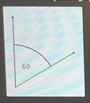

## Task 3

There are N arrows. The K-th arrow is rotated clockwise by A[K] degrees from an upward direction. In the picture below, 
the black arrow is pointing upwards, so it is rotated by 0 degrees. The green arrow is rotated by 60 degrees clockwise.



In one move you can rotate one arrow clockwise on counter-clockwise by an arbitrary angle. Your goal is to rotate
the arrows so that they all point in the same direction. In other words, after applying the rotations, A[K] should be the same
for every K.

Notice that the values given in array A denote the clockwise rotations of the arrows, but you can rotate them either clockwise 
or counter-clockwise.

What is the minimum sum of rotation angles needed to make all arrows point in the same direction?

Write a function:

```
class Task3 { public int solution(int[] A); }
```

that, given an array A made of N integers, describing the initial rotation of each arrow, returns the minimum sum 
of rotation angles needed to make all arrows point in the same direction.

Examples:

1. Given A = [20, 50, 100, 200], the function should return 230. You can rotate all of the arrows to 100 degrees. The first 
arrow must be rotated by 80 degrees clockwise, the second arrow by 50 degrees clockwise and the fourth arrow by 100 degrees 
counter-clockwise. The sum of all rotations is equal to 230.
2. Given A = [350, 0, 0], the function should return 10. You can rotate all of the arrows to 0 degrees, so only the first 
arrow needs to be rotated by 10 degrees clockwise.
3. Given A = [270, 301, 301, 302, 50, 70, 100], the function should return 428. You can rotate all of the arrows to 302 degrees.
The first arrow should be rotated by 32 degrees clockwise and the second and third by 1 degree clockwise each. 
The last three arrows should be rotated by 108, 128 and 158 degrees counter-clockwise, respectively.

Write an efficient algorithm for the following assumptions:
- N is an integer in the range [1..500,000];
- each element of array A is an integer within the range [0..359].
